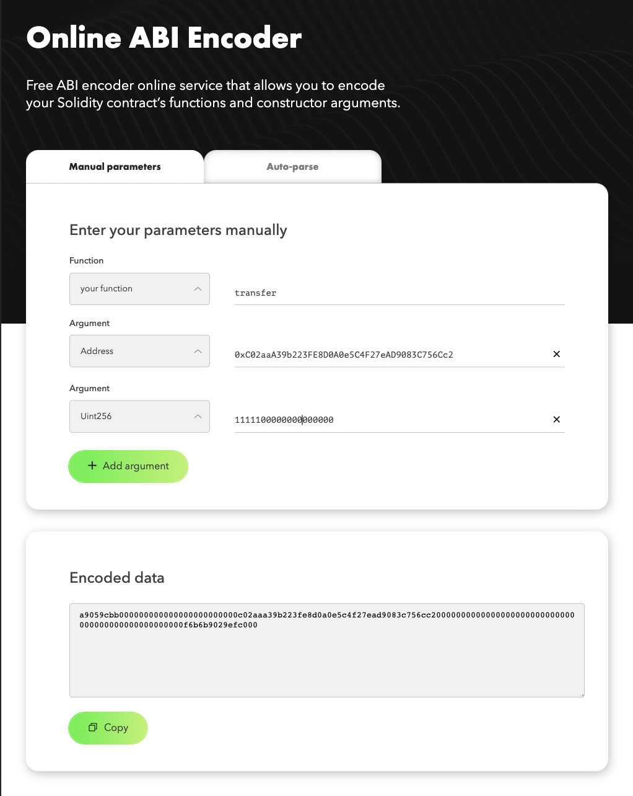
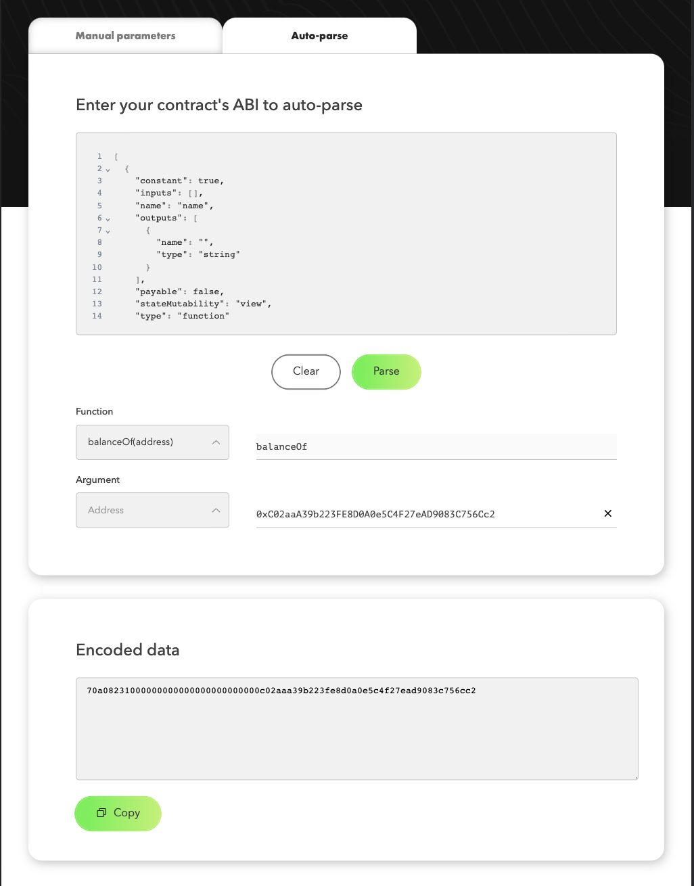
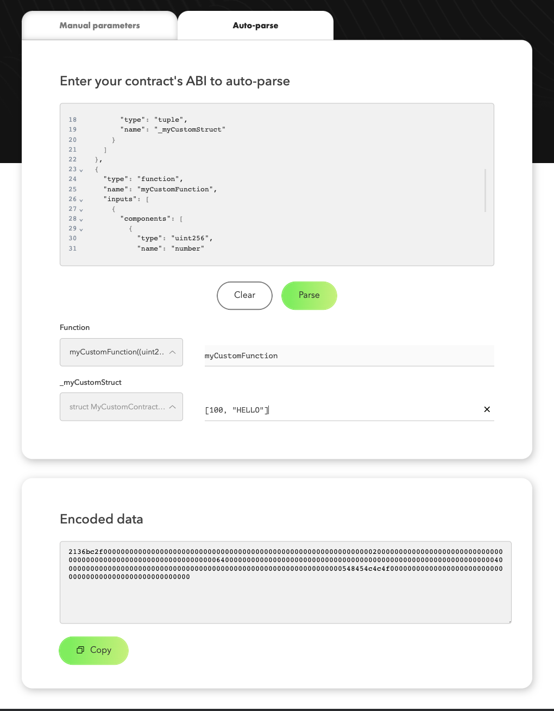

# ABI Encoder

[https://abi.hashex.org](https://abi.hashex.org)

## Description

Free [ABI](https://docs.soliditylang.org/en/v0.8.2/abi-spec.html) encoder online service that allows you to encode your [Solidity](https://docs.soliditylang.org/en/v0.8.6/) contract’s  functions and constructor arguments.

ABI itself is the description of the code interface. It’s a way for the contracts to interact within an ecosystem as well as contract-to-contract.

Smart contract ABI parsing is required for verifying the contract on Etherscan or making a transaction to call a method, for example for a Timelock contract. For most actions regarding this code, you would require a special tool, and the arguments have to be encoded in a specific way. HashEx tool does it automatically, free, and doesn’t involve downloading any extra applications.

Code itself is used in the byte format, so it’s harder to decode it correctly. For easy interactions with said code, HashEx has created its ABI decoder. An additional tool allows you to manually enter the values for the parameters.

### Supported types

- uint8..256
- uint[]8..256
- bytes8..32
- bytes[]8..32
- address
- address[]
- string
- bool
- bool[]
- tuple (supports Struct from ABI)

Feel free to open PR to add new types.

## How to use

### Manually enter

1. Enter signature of function (Example: `transferFrom(adress, uint)`) manually with selecting "your function" option or use the "constructor" option.
2. Add arguments, select the correct types.
3. Fill the arguments.
4. Encoded data will appear in the text area under the function. Click "Copy" button and paste it where ever you want.




### Using ABI autoparse 
1. Enter your contract ABI into the text field and click "Parse" button.
2. Select the function or constructor from the parsed list.
3. Fill the arguments.
4. Encoded data will appear in the text area under the function. Click "Copy" button and paste it where ever you want.



## How to encode struct arguments

### Encode struct argument with existing ABI

1. Enter your contract ABI into the text field and click "Parse" button.
2. Select the function or constructor from the parsed list which has struct argument.
3. Enter struct value according to example. Use Struct description under input as a hint.
4. Encoded data will appear in the text area under the function. Click "Copy" button and paste it where ever you want.



### Encode struct argument without existing ABI

0. Describe your function or constructor using ABI template.

Function example:

```sol
    contract MyCustomContract {
        struct MyCustomStruct {
            uint256 number;
            address to;
        }
        constructor(MyCustomStruct memory _myCustomStruct) {
            // some logic
        }
        function myCustomFunction(MyCustomStruct memory _myCustomStruct) {
            // some logic
        }
    }
```

ABI example:

```js
    [{
        "type": "constructor",
        "name": "",
        "inputs": [{
            "components": [{ 
                "type": "uint256",
                "name": "number"
            },{
                "type": "string",
                "name": "note"
            }],
            "internalType": "struct MyCustomContract.MyCustomStruct",
            "type": "tuple",
            "name": "_myCustomStruct"
        }]
    },{
        "type": "function",
        "name": "myCustomFunction",
        "inputs": [{
            "components": [{ 
                "type": "uint256",
                "name": "number"
            },{
                "type": "string",
                "name": "note"
            }],
            "internalType": "struct MyCustomContract.MyCustomStruct",
            "name": "_myCustomStruct",
            "type": "tuple"
        }]
    }]
``` 


```js
"components": [...],    // `components` field is for Struct fields description
"type": "tuple",        // this type means you want to use Struct as argument
```

then follow the [steps](#encode-struct-argument-with-existing-abi) as if you have ABI to parse.

## How to run

### Install dependencies
`npm install` or `yarn`

### Start project
`npm start` or `yarn start`

…and open http://localhost:3000 in your web browser.

## Contributing

The site is powered by [CRA(Create React App)](https://reactjs.org/docs/create-a-new-react-app.html) using [React.js](https://reactjs.org/) and [ethers.js](https://github.com/ethers-io/ethers.js).

1. Fork the repo on GitHub
2. Clone the project to your own machine
3. Commit changes to your own branch
4. Push your work back up to your fork
5. Submit a Pull request so that we can review your changes

NOTE: Be sure to merge the latest from "upstream" before making a pull request!

### Licenses

[MIT](https://en.m.wikipedia.org/wiki/MIT_License)
